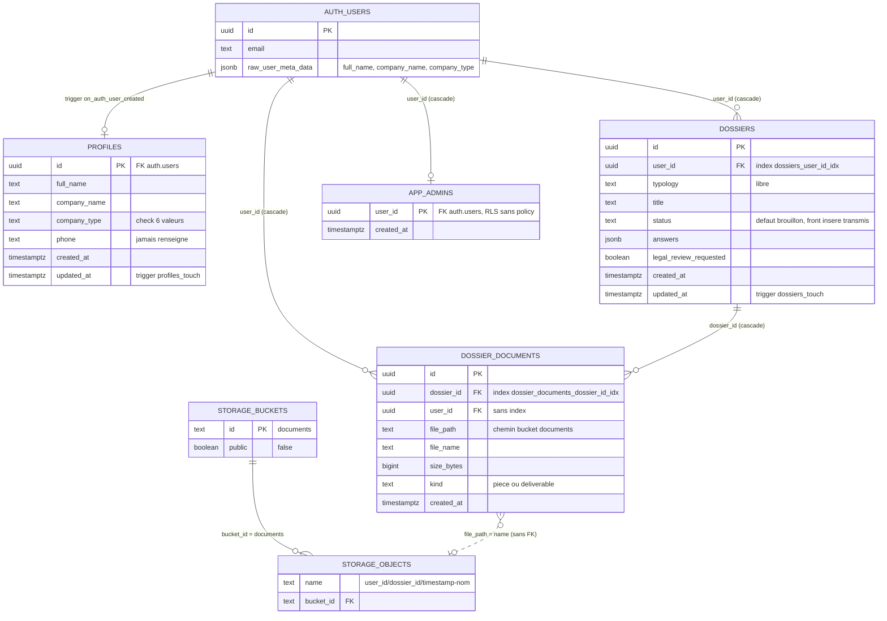
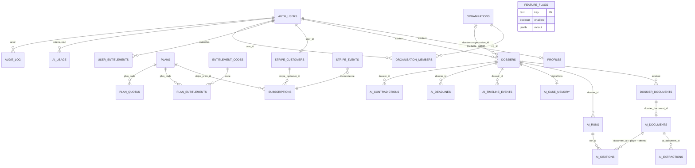

# Carte Stripe / Supabase — ClairDossier Baseline v1

**Livrable** : PHASE 0 · XI.5 étape 5 « Créer la carte Stripe/Supabase ».
**Règles constitutionnelles appliquées** : I.3 (aucune suppression de table, bucket, webhook, produit Stripe, policy), V.2 « NE PAS REFAIRE STRIPE », V.3 (migration pricing sans risque), IX.4 « KEEP SUPABASE », II.7.3 (tables additives préfixées, colonnes additives nullables uniquement), IX.5 (backup avant migration).
**Date** : 2026-08-23.
**Dépôt** : `/Users/Roman_784/Documents/Codex/2026-07-02/contrainte-absolue-ne-pas-toucher-aux/work/www.clair-dossier.com` — branche `feature/clairdossier-next`, HEAD `24e1e2b` (identique à `origin/main` pour le code ; seuls `docs/`, `CLAUDE.md`, `.claude/`, `scripts/guard_destructive.py` sont des ajouts non suivis de la Phase 0).
**Méthode** : lecture seule des sources primaires (`supabase/migrations/*.sql`, `supabase/config.toml`, `supabase/functions/notify-lead/index.ts`, `scripts/create-stripe-products.mjs`, `scripts/add-annual-prices.mjs`, `src/data/pricing.ts`, `src/pages/Account.tsx`, `src/pages/DossierFlow.tsx`, `src/pages/DossierDetail.tsx`, `src/pages/Pricing.tsx`, `src/data/legal.ts`, `.github/workflows/deploy.yml`, `netlify.toml`, `.env.example`) croisée avec les sept rapports d'audit Phase 0 (`supabase.md`, `stripe-pricing.md`, `app-auth.md`, `routes-seo.md`, `live-site.md`, `identity-legal.md`, `public-content.md`). Aucun fichier `.env` lu. Aucune commande git modifiant l'état. Aucun accès aux dashboards Supabase et Stripe.
**Convention** : chaque fait cite `fichier:ligne` (chemins relatifs à la racine du dépôt). Tout ce qui dépend de l'état réel des projets hébergés est marqué **À VÉRIFIER** (liste consolidée en §9). Les sections 5, 6 et 7 sont des **PROPOSITIONS** (aucune implémentation, aucune migration écrite).

---

## 0. Lecture rapide

| Sujet | État constaté | Preuve |
|---|---|---|
| Backend | Supabase, projet hébergé `buzgokfmxpmyceppvjpp`, Postgres 17 attendu | `supabase/migrations/20260617110728_dossier_lead_notification.sql:15`, `.github/workflows/deploy.yml:42`, `supabase/config.toml:36` |
| Schéma `public` | 4 tables (`profiles`, `dossiers`, `dossier_documents`, `app_admins`), 0 enum, 0 vue, 2 index hors PK | 6 migrations (§1) |
| Stockage | 1 bucket privé `documents`, chemin `<user_id>/<dossier_id>/…` | `…init.sql:103-105`, `src/pages/DossierFlow.tsx:360` |
| RLS | 16 policies (10 `_own` + 6 `_admin`), toutes PERMISSIVE, sans clause `to` | §2 |
| Fonctions SQL | 5 (`touch_updated_at`, `handle_new_user`, `notify_lead`, `is_admin`, `admin_user_emails`) ; 5 triggers | §3.1-3.2 |
| Edge functions | 1 : `notify-lead` (Resend → `prestige.seller@icloud.com`) | `supabase/functions/notify-lead/index.ts:8` |
| Stripe | 12 Payment Links en dur (6 mensuels + 6 annuels), 2 scripts d'admin, **aucun** SDK, webhook, table, portail, mapping client | §4 |
| Droits / abonnement | **Aucun gating** : tout compte confirmé a tous les droits ; bandeau « Abonnement confirmé » déclenché par `?paid=` sans vérification | `src/pages/Account.tsx:31,89-98` |
| Déploiement backend | Aucun `supabase db push` / `functions deploy` en CI → correspondance dépôt ↔ prod **À VÉRIFIER** | `.github/workflows/deploy.yml:22-58` |
| Chaîne V.5 | AUTH ✓ · ORGANIZATION ✗ · ROLE (admin unique) ~ · SUBSCRIPTION ✗ · ENTITLEMENT ✗ · QUOTA ✗ | §6.4 |

---

## 1. Schéma Supabase complet

### 1.1 Identification du projet

| Élément | Valeur | Source |
|---|---|---|
| `project_id` CLI (local) | `clair-dossier` | `supabase/config.toml:5` |
| Ref du projet hébergé | `buzgokfmxpmyceppvjpp` | `supabase/migrations/20260617110728_dossier_lead_notification.sql:15` ; `.github/workflows/deploy.yml:42` ; `netlify.toml:26` |
| URL API | `https://buzgokfmxpmyceppvjpp.supabase.co` | idem |
| Clé anon | JWT HS256, claims `role=anon`, `ref=buzgokfmxpmyceppvjpp`, `iat=1781549969`, `exp=2097125969` ; présente en clair dans `deploy.yml:43` et **dans une migration SQL** `…lead_notification.sql:18` | rapport `supabase.md` §1.1 (décodage sans signature) |
| Région du projet | **À VÉRIFIER** (non déductible du dépôt ; enjeu RGPD, cf. `identity-legal.md` §5.1) | — |
| Schémas exposés par l'API | `public`, `graphql_public` ; `max_rows = 1000` | `supabase/config.toml:13,18` |
| Santé | `GET /auth/v1/health` sans clé → 401 « No API key found » (projet vivant) | `live-site.md` §8 |

### 1.2 Tables

Aucun type `enum` Postgres n'est défini ; les domaines de valeurs sont des contraintes `check`. Toutes les tables sont dans `public`.

#### `public.profiles` — créée par `supabase/migrations/20260615201942_clair_dossier_init.sql:5-17`

| Colonne | Type | Null | Défaut | Contrainte | Source |
|---|---|---|---|---|---|
| `id` | `uuid` | NOT NULL | — | PK ; FK → `auth.users(id) ON DELETE CASCADE` | `…init.sql:6` |
| `full_name` | `text` | NULL | — | — | `…init.sql:7` |
| `company_name` | `text` | NULL | — | — | `…init.sql:8` |
| `company_type` | `text` | NULL | — | `check (company_type in ('pme','artisan','entreprise-individuelle','profession-liberale','particulier','autre'))` | `…init.sql:9-13` |
| `phone` | `text` | NULL | — | jamais alimentée par le code (ni `handle_new_user`, ni le front) | `…init.sql:14` ; `src/lib/auth.tsx:77-87` |
| `created_at` | `timestamptz` | NOT NULL | `now()` | — | `…init.sql:15` |
| `updated_at` | `timestamptz` | NOT NULL | `now()` | maintenue par trigger `profiles_touch` | `…init.sql:16,74-76` |

Index : PK uniquement. RLS activée (`…init.sql:48`). Alimentée exclusivement par le trigger `on_auth_user_created` → `handle_new_user` (§3.2). Le front ne lit `profiles` qu'en mode admin (`src/pages/Account.tsx:55`) ; jamais d'`update`/`insert` front.

#### `public.dossiers` — créée par `…init.sql:20-30`

| Colonne | Type | Null | Défaut | Contrainte | Source |
|---|---|---|---|---|---|
| `id` | `uuid` | NOT NULL | `gen_random_uuid()` | PK | `…init.sql:21` |
| `user_id` | `uuid` | NOT NULL | — | FK → `auth.users(id) ON DELETE CASCADE` | `…init.sql:22` |
| `typology` | `text` | NOT NULL | — | **aucune contrainte de valeur** (valeurs front : `dossier-client`, `facture-paiement`, `impaye-precontentieux`, `administratif`, `comptable`, `rh`, `autre` ; 7 anciennes typologies conservées à l'affichage) | `…init.sql:23` ; `src/pages/DossierFlow.tsx:70-106` ; `src/pages/DossierDetail.tsx:35-52` |
| `title` | `text` | NULL | — | — | `…init.sql:24` |
| `status` | `text` | NOT NULL | `'brouillon'` | **aucune contrainte** ; le front insère toujours `'transmis'` ; libellés front `brouillon`, `transmis`, `en-cours`, `valide`, `archive` | `…init.sql:25` ; `src/pages/DossierFlow.tsx:348` ; `src/pages/Account.tsx:19-25` |
| `answers` | `jsonb` | NOT NULL | `'{}'::jsonb` | réponses du tunnel + clé `profil` | `…init.sql:26` ; `DossierFlow.tsx:336-339` |
| `legal_review_requested` | `boolean` | NOT NULL | `false` | — | `…init.sql:27` ; `DossierFlow.tsx:347` |
| `created_at` | `timestamptz` | NOT NULL | `now()` | — | `…init.sql:28` |
| `updated_at` | `timestamptz` | NOT NULL | `now()` | trigger `dossiers_touch` | `…init.sql:29,78-80` |

Index : PK ; `dossiers_user_id_idx (user_id)` (`…init.sql:32`). RLS activée (`…init.sql:49`). Aucun `update` ni `delete` effectué par le front (grep `.update(` dans `src/` : 0).

#### `public.dossier_documents` — créée par `…init.sql:35-43`, étendue par `…20260628093000_dossier_deliverables.sql:13-19`

| Colonne | Type | Null | Défaut | Contrainte | Source |
|---|---|---|---|---|---|
| `id` | `uuid` | NOT NULL | `gen_random_uuid()` | PK | `…init.sql:36` |
| `dossier_id` | `uuid` | NOT NULL | — | FK → `public.dossiers(id) ON DELETE CASCADE` | `…init.sql:37` |
| `user_id` | `uuid` | NOT NULL | — | FK → `auth.users(id) ON DELETE CASCADE` | `…init.sql:38` |
| `file_path` | `text` | NOT NULL | — | chemin dans le bucket `documents` ; **aucune FK vers `storage.objects`** | `…init.sql:39` |
| `file_name` | `text` | NOT NULL | — | — | `…init.sql:40` |
| `size_bytes` | `bigint` | NULL | — | — | `…init.sql:41` |
| `created_at` | `timestamptz` | NOT NULL | `now()` | — | `…init.sql:42` |
| `kind` | `text` | NOT NULL | `'piece'` | `dossier_documents_kind_check check (kind in ('piece','deliverable'))` | `…deliverables.sql:13-19` |

Index : PK ; `dossier_documents_dossier_id_idx (dossier_id)` (`…init.sql:45`). **Pas d'index sur `user_id`** bien que toutes les policies `_own` filtrent dessus. Pas de colonne `updated_at`, pas de trigger. RLS activée (`…init.sql:50`).

#### `public.app_admins` — créée par `…20260621144123_admin_global_access.sql:11-14`

| Colonne | Type | Null | Défaut | Contrainte | Source |
|---|---|---|---|---|---|
| `user_id` | `uuid` | NOT NULL | — | PK ; FK → `auth.users(id) ON DELETE CASCADE` | `…admin_global_access.sql:12` |
| `created_at` | `timestamptz` | NOT NULL | `now()` | — | `…admin_global_access.sql:13` |

RLS activée, **zéro policy**, `revoke all on public.app_admins from anon, authenticated` (`…admin_global_access.sql:15-17`). Peuplée une fois par `insert … select id from auth.users where email = 'prestige.seller@icloud.com' on conflict (user_id) do nothing` (`:20-22`). Contenu réel **À VÉRIFIER** (si le compte n'existait pas lors de l'application de M3, la table est vide et l'espace admin est inopérant).

### 1.3 Contraintes de domaine (pas d'enum)

| Table.colonne | Valeurs autorisées | Source |
|---|---|---|
| `profiles.company_type` | `pme`, `artisan`, `entreprise-individuelle`, `profession-liberale`, `particulier`, `autre` (ou NULL) | `…init.sql:9-13` |
| `dossier_documents.kind` | `piece`, `deliverable` | `…deliverables.sql:19` |
| `dossiers.status`, `dossiers.typology` | libres (`text`) | `…init.sql:23,25` |

### 1.4 Clés étrangères et cascades

| Table enfant | Colonne | Référence | Cascade | Source |
|---|---|---|---|---|
| `profiles` | `id` | `auth.users(id)` | `ON DELETE CASCADE` | `…init.sql:6` |
| `dossiers` | `user_id` | `auth.users(id)` | `ON DELETE CASCADE` | `…init.sql:22` |
| `dossier_documents` | `dossier_id` | `public.dossiers(id)` | `ON DELETE CASCADE` | `…init.sql:37` |
| `dossier_documents` | `user_id` | `auth.users(id)` | `ON DELETE CASCADE` | `…init.sql:38` |
| `app_admins` | `user_id` | `auth.users(id)` | `ON DELETE CASCADE` | `…admin_global_access.sql:12` |
| `dossier_documents.file_path` → `storage.objects.name` | — | **aucune FK** : la suppression SQL ne supprime pas le fichier ; fichiers orphelins possibles | `…init.sql:39` ; `src/pages/DossierDetail.tsx:414-418` |

### 1.5 Diagramme entité-relation (état actuel)



### 1.6 Historique des migrations (ordre d'application attendu)

| # | Fichier | Objets |
|---|---|---|
| M1 | `supabase/migrations/20260615201942_clair_dossier_init.sql` | 3 tables, 2 index, RLS + 10 policies, fonctions `touch_updated_at`/`handle_new_user`, 3 triggers, bucket `documents`, 3 policies storage |
| M2 | `supabase/migrations/20260617110728_dossier_lead_notification.sql` | extension `pg_net`, fonction `notify_lead`, 2 triggers |
| M3 | `supabase/migrations/20260621144123_admin_global_access.sql` | table `app_admins`, fonction `is_admin`, 4 policies admin (3 tables + storage) |
| M4 | `supabase/migrations/20260622062648_admin_user_emails.sql` | fonction `admin_user_emails` |
| M5 | `supabase/migrations/20260628093000_dossier_deliverables.sql` | colonne `kind` + check, 2 policies insert admin |
| M6 | `supabase/migrations/20260701093000_admin_delete_documents.sql` | 2 policies delete admin |

`supabase/config.toml:60-65` référence `./seed.sql` qui **n'existe pas** (`ls supabase/seed.sql` → absent). Migrations réellement appliquées en prod (`supabase_migrations.schema_migrations`) : **À VÉRIFIER**.

### 1.7 Consommation du schéma par le frontend (inventaire exhaustif des appels)

| Table / bucket / fonction | Opérations front | Fichier:ligne |
|---|---|---|
| `dossiers` | `select` sans filtre (RLS) ; `select … eq('id') maybeSingle` ; `insert` (`status: "transmis"`) | `src/pages/Account.tsx:47-50` ; `src/pages/DossierDetail.tsx:241-247` ; `src/pages/DossierFlow.tsx:340-351` |
| `dossier_documents` | `select … eq('dossier_id')` ; `insert` (client, sans `kind`) ; `insert` (admin, `kind: "deliverable"`, `user_id` du client) ; `delete … eq('id')` (admin) | `DossierDetail.tsx:271-275,315-319` ; `DossierFlow.tsx:365-371` ; `DossierDetail.tsx:348-355` ; `DossierDetail.tsx:415-418` |
| `profiles` | `select id,company_name,full_name` (admin uniquement) | `Account.tsx:55` |
| bucket `documents` | `upload` (`upsert:false`) ; `createSignedUrl(path, 3600)` ; `remove` | `DossierFlow.tsx:361-363` ; `DossierDetail.tsx:284-286,325-327,344-346,414` |
| RPC `is_admin` | à chaque chargement de `/compte` et du détail | `Account.tsx:42` ; `DossierDetail.tsx:253` |
| RPC `admin_user_emails` | admin uniquement | `Account.tsx:61` ; `DossierDetail.tsx:261` |
| Auth | `getSession`, `onAuthStateChange`, `signUp` (metadata `full_name`, `company_name`, `company_type`), `signInWithPassword`, `signOut` | `src/lib/auth.tsx:61,66,77-87,95,102` |

Jamais utilisés par le front : `update` sur toute table, `delete` sur `dossiers`, `storage.list/download`, `resetPasswordForEmail`, `updateUser`, realtime.

---

## 2. Policies RLS — texte exact et analyse d'isolation

### 2.1 Propriétés communes

- Toutes les policies sont **PERMISSIVE** (aucun `as restrictive`) : elles se combinent en **OR** entre elles (`…admin_global_access.sql:37` le rappelle explicitement).
- Aucune policy ne porte de clause `to <role>` : elles sont évaluées pour **tous** les rôles (`anon`, `authenticated`, …). Pour `anon`, `auth.uid()` est NULL → les `_own` ne matchent jamais ; les `_admin` appellent `is_admin()` sur lequel `anon` n'a pas `EXECUTE` (`…admin_global_access.sql:34`) → comportement d'erreur possible, **À VÉRIFIER** (cf. §2.6, R11).
- Les policies admin sont **additives en lecture** + insert/delete sur documents ; **aucune policy UPDATE admin** sur aucune table, **aucune policy UPDATE** du tout sur `dossier_documents` et `storage.objects`.

### 2.2 `public.profiles` (RLS activée `…init.sql:48`)

| Nom | Cmd | Texte exact | Source |
|---|---|---|---|
| `profiles_select_own` | SELECT | `create policy "profiles_select_own" on public.profiles for select using (auth.uid() = id);` | `…init.sql:52` |
| `profiles_insert_own` | INSERT | `create policy "profiles_insert_own" on public.profiles for insert with check (auth.uid() = id);` | `…init.sql:53` |
| `profiles_update_own` | UPDATE | `create policy "profiles_update_own" on public.profiles for update using (auth.uid() = id) with check (auth.uid() = id);` | `…init.sql:54` |
| `profiles_select_admin` | SELECT | `create policy "profiles_select_admin" on public.profiles for select using (public.is_admin());` | `…admin_global_access.sql:46-48` |

Pas de DELETE (suppression par cascade depuis `auth.users` uniquement).

### 2.3 `public.dossiers` (RLS activée `…init.sql:49`)

| Nom | Cmd | Texte exact | Source |
|---|---|---|---|
| `dossiers_select_own` | SELECT | `create policy "dossiers_select_own" on public.dossiers for select using (auth.uid() = user_id);` | `…init.sql:56` |
| `dossiers_insert_own` | INSERT | `create policy "dossiers_insert_own" on public.dossiers for insert with check (auth.uid() = user_id);` | `…init.sql:57` |
| `dossiers_update_own` | UPDATE | `create policy "dossiers_update_own" on public.dossiers for update using (auth.uid() = user_id) with check (auth.uid() = user_id);` | `…init.sql:58` |
| `dossiers_delete_own` | DELETE | `create policy "dossiers_delete_own" on public.dossiers for delete using (auth.uid() = user_id);` | `…init.sql:59` |
| `dossiers_select_admin` | SELECT | `create policy "dossiers_select_admin" on public.dossiers for select using (public.is_admin());` | `…admin_global_access.sql:38-40` |

Conséquence : l'admin **ne peut pas** faire évoluer `status` d'un dossier client via l'API (aucune policy UPDATE admin) ; seul `service_role` ou SQL direct le peut.

### 2.4 `public.dossier_documents` (RLS activée `…init.sql:50`)

| Nom | Cmd | Texte exact | Source |
|---|---|---|---|
| `docs_select_own` | SELECT | `create policy "docs_select_own" on public.dossier_documents for select using (auth.uid() = user_id);` | `…init.sql:61` |
| `docs_insert_own` | INSERT | `create policy "docs_insert_own" on public.dossier_documents for insert with check (auth.uid() = user_id);` | `…init.sql:62` |
| `docs_delete_own` | DELETE | `create policy "docs_delete_own" on public.dossier_documents for delete using (auth.uid() = user_id);` | `…init.sql:63` |
| `docs_select_admin` | SELECT | `create policy "docs_select_admin" on public.dossier_documents for select using (public.is_admin());` | `…admin_global_access.sql:42-44` |
| `docs_insert_admin` | INSERT | `create policy "docs_insert_admin" on public.dossier_documents for insert with check (public.is_admin());` | `…deliverables.sql:22-24` |
| `docs_delete_admin` | DELETE | `create policy "docs_delete_admin" on public.dossier_documents for delete using (public.is_admin());` | `…admin_delete_documents.sql:5-7` |

### 2.5 `public.app_admins` et `storage.objects`

`app_admins` : RLS activée, **aucune policy**, `revoke all on public.app_admins from anon, authenticated;` (`…admin_global_access.sql:15-17`).

`storage.objects` (bucket `documents`, privé `…init.sql:103-105`) :

| Nom | Cmd | Texte exact | Source |
|---|---|---|---|
| `docs_storage_select_own` | SELECT | `create policy "docs_storage_select_own" on storage.objects for select using (bucket_id = 'documents' and auth.uid()::text = (storage.foldername(name))[1]);` | `…init.sql:108-109` |
| `docs_storage_insert_own` | INSERT | `create policy "docs_storage_insert_own" on storage.objects for insert with check (bucket_id = 'documents' and auth.uid()::text = (storage.foldername(name))[1]);` | `…init.sql:110-111` |
| `docs_storage_delete_own` | DELETE | `create policy "docs_storage_delete_own" on storage.objects for delete using (bucket_id = 'documents' and auth.uid()::text = (storage.foldername(name))[1]);` | `…init.sql:112-113` |
| `docs_storage_select_admin` | SELECT | `create policy "docs_storage_select_admin" on storage.objects for select using (bucket_id = 'documents' and public.is_admin());` | `…admin_global_access.sql:51-53` |
| `docs_storage_insert_admin` | INSERT | `create policy "docs_storage_insert_admin" on storage.objects for insert with check (bucket_id = 'documents' and public.is_admin());` | `…deliverables.sql:27-29` |
| `docs_storage_delete_admin` | DELETE | `create policy "docs_storage_delete_admin" on storage.objects for delete using (bucket_id = 'documents' and public.is_admin());` | `…admin_delete_documents.sql:9-11` |

L'isolation storage repose sur le **premier segment du chemin** (`(storage.foldername(name))[1]`) = `auth.uid()`. Le front respecte cette convention pour les pièces (`DossierFlow.tsx:360`) et pour les livrables déposés par l'admin **sous le `user_id` du client** (`DossierDetail.tsx:343,350`).

### 2.6 Matrice des droits effectifs par rôle (déduite des policies)

| Objet | `anon` | `authenticated` propriétaire | `authenticated` autre utilisateur | `authenticated` membre de `app_admins` | `service_role` |
|---|---|---|---|---|---|
| `profiles` (sa ligne) | rien (À VÉRIFIER : erreur 42501 possible via `is_admin`) | SELECT / INSERT / UPDATE | rien | SELECT de toutes les lignes ; pas d'UPDATE/INSERT d'autrui | tout |
| `dossiers` | rien | SELECT / INSERT / UPDATE / DELETE | rien | SELECT de tous ; **pas d'UPDATE/DELETE** | tout |
| `dossier_documents` | rien | SELECT / INSERT (si `user_id = uid`) / DELETE ; pas d'UPDATE | rien | SELECT tous ; INSERT pour n'importe quel `user_id`/`dossier_id` ; DELETE tous ; pas d'UPDATE | tout |
| `app_admins` | rien | rien | rien | rien (pas de policy) | tout |
| bucket `documents` | rien | SELECT / INSERT / DELETE sous `<uid>/…` ; pas d'UPDATE | rien | SELECT / INSERT / DELETE partout dans le bucket | tout |
| `is_admin()` | pas d'EXECUTE | `false` | `false` | `true` | — |
| `admin_user_emails()` | pas d'EXECUTE | 0 ligne | 0 ligne | tous les `(id, email)` d'`auth.users` | — |

### 2.7 Analyse d'isolation (IX.4 : A doit recevoir DENIED sur les données de B)

| Vecteur | Verdict d'après le code | Justification |
|---|---|---|
| A lit un `dossier` / `profile` / `dossier_document` de B (REST, SDK) | **Hermétique** | `using (auth.uid() = user_id)` (`…init.sql:52-63`) ; les policies admin ne s'ouvrent que si `is_admin()` lit une ligne dans `app_admins`, table sans policy ni grant (`…admin_global_access.sql:15-17,25-33`) |
| A télécharge un fichier de B (URL signée, download, list) | **Hermétique** | `docs_storage_select_own` (`…init.sql:108-109`) ; `createSignedUrl` est soumis aux policies storage au moment de la création de l'URL |
| A s'auto-promeut admin | **Impossible via l'API** | aucune policy + revoke sur `app_admins` ; `is_admin` est un booléen SECURITY DEFINER |
| A obtient les e-mails via `admin_user_emails()` | **0 ligne** | `where public.is_admin()` (`…admin_user_emails.sql:15`) |
| **Intégrité croisée** : A insère dans `dossier_documents` avec `user_id = A` et `dossier_id` = dossier de B | **Possible** (défaut de contrainte, pas de fuite) | `docs_insert_own` ne vérifie pas la propriété de `dossier_id` (`…init.sql:62`) ; pollue la vue admin filtrée par `dossier_id` (`DossierDetail.tsx:272`) |
| `file_path` incohérent avec l'objet storage | **Possible** | aucune contrainte/trigger ne valide `file_path` ↔ `storage.objects` ↔ `user_id` |
| Client supprime un livrable admin | **Oui, par conception** | livrable rangé sous `user_id` client → `docs_delete_own` + `docs_storage_delete_own` s'appliquent (`…deliverables.sql:4-10`) |
| Multi-tenant par organisation (dirigeant + comptable sur un même dossier) | **Inexistant** | `profiles` 1:1 avec `auth.users` ; aucune table d'organisation |

**Conclusion** : isolation lecture/écriture correcte **mono-utilisateur par tenant**, sous réserve que les 6 migrations soient bien appliquées en prod (**À VÉRIFIER**). Tests IX.4 à exécuter avant toute évolution (frontend, REST, SDK, URL signée) — à consigner dans `NON_REGRESSION_MATRIX.md`.

### 2.8 Faiblesses RLS à traiter de façon **additive** (jamais en modifiant une policy existante — II.7.2)

| # | Faiblesse | Source | Piste additive (proposition, non implémentée) |
|---|---|---|---|
| R6 | `docs_insert_own` ne vérifie pas la propriété du `dossier_id` | `…init.sql:62` | nouvelle policy **RESTRICTIVE** `docs_insert_dossier_owner_check` (`as restrictive for insert with check (exists (select 1 from dossiers d where d.id = dossier_id and (d.user_id = auth.uid() or public.is_admin())))`) — à tester pour ne pas casser les livrables admin |
| R11/R15 | policies sans `to authenticated`, `anon` sans EXECUTE sur `is_admin()` | toutes les policies ; `…admin_global_access.sql:34` | soit `grant execute on function public.is_admin() to anon` (renvoie `false`), soit nouvelles policies restreintes ; **À VÉRIFIER** d'abord le comportement réel d'une requête `anon` |
| R5 | aucun UPDATE admin sur `dossiers.status` | §2.3 | nouvelle policy `dossiers_update_admin` (additive) + contrainte `check` sur `status` via nouvelle table de référence |
| R14 | `status`/`typology` sans domaine | `…init.sql:23,25` | table de référence additive + trigger de validation, sans modifier la colonne |
| — | pas d'index `dossier_documents(user_id)` | `…init.sql:45` | `create index concurrently` additif |

---

## 3. Fonctions, triggers, bucket, edge function, configuration auth/SMTP, secrets

### 3.1 Fonctions SQL

| Fonction | Langage | SECURITY | Volatilité | `search_path` | Grants | Corps (résumé) | Source |
|---|---|---|---|---|---|---|---|
| `public.touch_updated_at()` → `trigger` | plpgsql | INVOKER (défaut) | — | non fixé | défauts | `new.updated_at = now()` | `…init.sql:66-72` |
| `public.handle_new_user()` → `trigger` | plpgsql | **DEFINER** | — | `public` | défauts | `insert into profiles (id, full_name, company_name, company_type)` depuis `new.raw_user_meta_data`, `on conflict (id) do nothing` | `…init.sql:83-96` |
| `public.notify_lead()` → `trigger` | plpgsql | **DEFINER** | — | `public` | défauts | `perform net.http_post(url := 'https://buzgokfmxpmyceppvjpp.supabase.co/functions/v1/notify-lead', headers := {Content-Type, Authorization: Bearer <clé anon en dur>}, body := {'table': tg_table_name, 'record': to_jsonb(new)})` | `…lead_notification.sql:7-24` |
| `public.is_admin()` → `boolean` | sql | **DEFINER** | `stable` | `public` | `revoke all … from public, anon` ; `grant execute … to authenticated` | `select exists (select 1 from public.app_admins where user_id = auth.uid())` | `…admin_global_access.sql:25-35` |
| `public.admin_user_emails()` → `table(id uuid, email text)` | sql | **DEFINER** | `stable` | `public, auth` | `revoke all … from public, anon` ; `grant execute … to authenticated` | `select u.id, u.email::text from auth.users u where public.is_admin()` | `…admin_user_emails.sql:6-19` |

### 3.2 Triggers

| Trigger | Table | Moment | Fonction | Source |
|---|---|---|---|---|
| `profiles_touch` | `public.profiles` | BEFORE UPDATE, row | `touch_updated_at` | `…init.sql:74-76` |
| `dossiers_touch` | `public.dossiers` | BEFORE UPDATE, row | `touch_updated_at` | `…init.sql:78-80` |
| `on_auth_user_created` | **`auth.users`** | AFTER INSERT, row | `handle_new_user` | `…init.sql:98-100` |
| `on_new_profile_notify` | `public.profiles` | AFTER INSERT, row | `notify_lead` | `…lead_notification.sql:26-29` |
| `on_new_dossier_notify` | `public.dossiers` | AFTER INSERT, row | `notify_lead` | `…lead_notification.sql:31-34` |

Chaîne d'inscription : `auth.users INSERT` → `on_auth_user_created` → `handle_new_user` → `profiles INSERT` → `on_new_profile_notify` → `notify_lead` → `net.http_post` (asynchrone via worker `pg_net`) → edge `notify-lead` → Resend → `prestige.seller@icloud.com`. Points de fragilité : une valeur `company_type` hors liste dans les metadata de signup fait échouer `handle_new_user` donc l'inscription (`…init.sql:9-13`) ; si `pg_net` est indisponible, `notify_lead` peut faire échouer l'insert (R3 de `supabase.md`).

### 3.3 Extensions, vues, cron, webhooks, realtime, grants

| Élément | Constat | Source |
|---|---|---|
| Extensions explicites | `create extension if not exists pg_net` (seule) | `…lead_notification.sql:5` |
| Vues | aucune | 6 migrations |
| `pg_cron` / jobs | aucun | — |
| Database Webhooks Supabase | aucun (mécanisme = trigger custom + `pg_net`) | — |
| Realtime | `[realtime] enabled = true` localement ; aucune table ajoutée à la publication | `supabase/config.toml:77-78` |
| Grants tables | uniquement `revoke all on public.app_admins from anon, authenticated` ; les autres tables gardent les privilèges par défaut, filtrés par RLS | `…admin_global_access.sql:17` |
| Grants fonctions | `is_admin`, `admin_user_emails` : revoke `public, anon`, grant `authenticated` | `…admin_global_access.sql:34-35` ; `…admin_user_emails.sql:18-19` |
| Objets créés hors migrations (Dashboard) | **À VÉRIFIER** | — |

### 3.4 Bucket Storage

| Bucket | `public` | Limites (bucket) | Limite globale locale | Convention de chemin | Source |
|---|---|---|---|---|---|
| `documents` | `false` | **non définies** (ni `file_size_limit`, ni `allowed_mime_types` dans la migration) — valeurs prod **À VÉRIFIER** | `[storage] file_size_limit = "50MiB"` (CLI locale) | pièces : `<user_id>/<dossier_id>/<Date.now()>-<nom_assaini>` ; livrables : `<client_user_id>/<dossier_id>/deliverable-<Date.now()>-<nom>` | `…init.sql:103-105` ; `supabase/config.toml:105-108` ; `DossierFlow.tsx:360` ; `DossierDetail.tsx:343` |

Aucune policy sur `storage.buckets`. Aucun quota par utilisateur. Aucune suppression en cascade des objets lors de la suppression d'un compte ou d'un dossier (fichiers orphelins possibles, R10).

### 3.5 Edge function `notify-lead` (`supabase/functions/notify-lead/index.ts`, 69 lignes)

| Aspect | Constat | Source |
|---|---|---|
| Runtime | `Deno.serve`, Deno 2 | `index.ts:10` ; `supabase/config.toml:362` |
| Déclencheur | POST depuis `notify_lead()` ; payload `{ table: 'profiles' \| 'dossiers', record }` | `index.ts:2-4,12-14` |
| Authentification entrante | aucune vérification dans le code ; l'appelant présente la **clé anon** ; `verify_jwt` non surchargé (aucune section `[functions.notify-lead]` dans `config.toml`) → valeur prod **À VÉRIFIER** | `index.ts:10-14` ; `…lead_notification.sql:18` |
| Secret attendu (nom) | `RESEND_API_KEY` (`Deno.env.get`, `''` si absent) | `index.ts:6` |
| Fournisseur | Resend, `POST https://api.resend.com/emails` | `index.ts:49` |
| Expéditeur / destinataire | `ClairDossier <noreply@clair-dossier.com>` → `prestige.seller@icloud.com` (en dur) | `index.ts:7-8` |
| Contenu | objet `ClairDossier — nouveau compte` / `— nouveau dossier`, `Référence : <8 car. de record.id>…`, lien `/compte` ou `/compte/dossier/<id>` ; minimisation RGPD volontaire | `index.ts:16-47` |
| Autres tables | `{ skipped: true, table }` 200 | `index.ts:34-39` |
| Erreurs | statut Resend relayé ; `catch` → 400 | `index.ts:58-67` |
| Déploiement | manuel (aucune étape CI) → version déployée **À VÉRIFIER** | `.github/workflows/deploy.yml` |
| Risque | appelable publiquement avec la clé anon (présente dans le bundle) → spam d'e-mails vers l'adresse admin (R1 `supabase.md`) | `index.ts:10-14` |

### 3.6 Configuration Auth et SMTP (`supabase/config.toml` — config CLI locale ; valeurs prod **À VÉRIFIER** dans Dashboard > Authentication)

| Paramètre | Valeur | Source |
|---|---|---|
| `site_url` | `https://www.clair-dossier.com` | `config.toml:150` |
| `additional_redirect_urls` | `https://www.clair-dossier.com`, `https://clair-dossier.com`, `https://clair-dossier.netlify.app`, `http://localhost:5173`, `http://127.0.0.1:5173` | `config.toml:152` |
| `jwt_expiry` / rotation refresh / reuse interval | 3600 s / `true` / 10 s | `config.toml:154,160,163` |
| `enable_signup` / anonymes / manual linking | `true` / `false` / `false` | `config.toml:165-169` |
| `minimum_password_length` / `password_requirements` | 8 / `""` (aucune complexité) | `config.toml:171,174` |
| `[auth.email]` | `enable_signup=true`, `double_confirm_changes=true`, **`enable_confirmations=true`**, `secure_password_change=false`, `max_frequency="1s"`, OTP 6 / 3600 s | `config.toml:198-213` |
| `[auth.email.smtp]` | `enabled=true`, `host="smtp.resend.com"`, `port=465`, `user="resend"`, `pass="env(RESEND_SMTP_PASSWORD)"`, `admin_email="noreply@clair-dossier.com"`, `sender_name="ClairDossier"` | `config.toml:215-223` |
| Templates e-mail | par défaut (sections commentées) | `config.toml:225-234` |
| Hooks auth (`before_user_created`, `custom_access_token`) | commentés → **aucun claim personnalisé** (pas d'`is_admin` ni de plan dans le JWT) | `config.toml:257-265` |
| MFA | TOTP `enroll/verify = false`, phone `false`, WebAuthn commenté | `config.toml:275-296` |
| OAuth externe / SMS / captcha | Apple `enabled=false` seul bloc ; SMS `false` ; captcha commenté | `config.toml:192-196,236-244,298-314` |
| Sessions (`timebox`, `inactivity_timeout`) | commentées → illimitées | `config.toml:250-255` |

Le front ne gère pas le cas « confirmation e-mail requise » (redirige vers `/compte` sans session — `src/pages/Signup.tsx:44-48`, `app-auth.md` F1). Si `enable_confirmations` est actif en prod, chaque nouvel inscrit rebondit sur `/connexion` sans explication.

### 3.7 Secrets et variables d'environnement (noms uniquement — aucune valeur relevée)

| Nom | Où il est lu | Rôle | Où la valeur vit | Source |
|---|---|---|---|---|
| `VITE_SUPABASE_URL` | `src/lib/supabase.ts:3` | URL projet (publique) | en clair dans `deploy.yml:42` ; `.env.example:2` ; Netlify (**À VÉRIFIER**) | — |
| `VITE_SUPABASE_ANON_KEY` | `src/lib/supabase.ts:4` | clé anon (publique, protégée par RLS) | en clair dans `deploy.yml:43` **et** dans `…lead_notification.sql:18` | — |
| `VITE_BASE_PATH` | `vite.config.ts:20` | base Vite | `deploy.yml:40` | — |
| `RESEND_API_KEY` | `supabase/functions/notify-lead/index.ts:6` | envoi e-mail edge function | secrets Edge Functions Supabase (**À VÉRIFIER**) | — |
| `RESEND_SMTP_PASSWORD` | `supabase/config.toml:221` (`env(...)`) | SMTP auth Supabase | Dashboard Auth > SMTP (**À VÉRIFIER**) | — |
| `STRIPE_SECRET_KEY` | `scripts/create-stripe-products.mjs:18` ; `scripts/add-annual-prices.mjs:11` | scripts d'admin Stripe (préfixe `sk_`/`rk_` `_test_`/`_live_`) | poste de l'opérateur ; **absente** de `.env.example` et de la CI | — |
| `OPENAI_API_KEY`, `S3_*` (`[experimental]`) | `supabase/config.toml:91,374-384` | Studio local / template | non utilisés en prod | — |

Absents du dépôt (grep = 0) : `STRIPE_WEBHOOK_SECRET`, `STRIPE_PUBLISHABLE_KEY`, `VITE_STRIPE_*`, `SUPABASE_SERVICE_ROLE_KEY`. Aucun `${{ secrets.* }}` dans `deploy.yml`. `.gitignore:12-14` exclut `.env` et `.env.*` sauf `.env.example`.

### 3.8 Déploiement backend

`.github/workflows/deploy.yml:22-58` = `npm ci` → `npm run build` → GitHub Pages. **Aucune** étape `supabase db push`, `supabase functions deploy`, `supabase config push`, `supabase secrets set`. La conformité prod ↔ dépôt (migrations, fonction, config auth, secrets) n'est garantie par rien et doit être vérifiée avant toute migration (§8).

---

## 4. Stripe — existant (V.2 : NE PAS REFAIRE)

### 4.1 Nature de l'intégration

L'intégration se limite à **12 Stripe Payment Links codés en dur** dans `src/data/pricing.ts` et à **deux scripts Node** lancés manuellement :

| Constat | Preuve |
|---|---|
| Aucune dépendance `stripe` / `@stripe/stripe-js` | `package.json` et `package-lock.json` : 0 occurrence de `"stripe` (grep) ; les scripts `import Stripe from 'stripe'` (`create-stripe-products.mjs:16`, `add-annual-prices.mjs:9`) ne tournent qu'avec une installation ad hoc non tracée |
| Aucun code Stripe côté client hors URLs | grep `stripe` dans `src/` : 12 URLs `pricing.ts` + 4 mentions légales `src/data/legal.ts:168,279,323,430` |
| Aucun code Stripe côté serveur | seule edge function : `notify-lead` ; grep `stripe\|webhook` dans `supabase/functions/` : 0 |
| Aucun ID Stripe versionné | grep `price_` / `prod_` / `plink_` : 0 dans `src/`, `public/`, `scripts/`, `supabase/` |
| CSP Netlify | `form-action 'self' https://buy.stripe.com` (`netlify.toml:26`) — inopérante en prod (GitHub Pages) et inutile (liens `<a href>`, pas de formulaire) |

### 4.2 Les sept formules et les 12 Payment Links (`src/data/pricing.ts:35-225`)

Remise annuelle `YEARLY_DISCOUNT = 0.1` (`pricing.ts:246`) ; total annuel = mensuel × 12 × 0,9 (`pricing.ts:254-256`). Prix affichés HT (`src/pages/Pricing.tsx:63-67`).

| # | `id` | Nom | Audience | Mensuel HT | Annuel HT | Badge | Payment Link mensuel | Payment Link annuel | Quotas affichés (dossiers / utilisateurs / support) | Lignes |
|---|---|---|---|---|---|---|---|---|---|---|
| 1 | `essentiel` | Essentiel | Indépendant / EI | 19 € | 205,20 € | — | `https://buy.stripe.com/00w9AT9Qm7fJ4vbeSibV605` | `https://buy.stripe.com/dRm9ATbYu6bF9PvfWmbV60b` | 5 / 1 / Support email | `:36-62` |
| 2 | `entrepreneur` | Entrepreneur | Entrepreneur / prof. libérale | 39 € | 421,20 € | — | `https://buy.stripe.com/8x214n1jQ2Zt9Pvh0qbV606` | `https://buy.stripe.com/28EeVd9QmgQj7HndOebV60c` | 10 / 2 / Support email prioritaire | `:63-89` |
| 3 | `business-pme-20` | Business PME 20 | TPE / PME | 49 € | 529,20 € | Populaire | `https://buy.stripe.com/5kQaEX7IeeIb4vb11sbV607` | `https://buy.stripe.com/14AbJ18MicA3e5L11sbV60d` | 20 / 5 / Support prioritaire | `:90-117` |
| 4 | `business-pme-50` | Business PME 50 | PME | 89 € | 961,20 € | — | `https://buy.stripe.com/28E4gz8Mi9nRaTz25wbV608` | `https://buy.stripe.com/6oU00j5A69nR3r7bG6bV60e` | 50 / 5 / Support prioritaire | `:118-143` |
| 5 | `business-pme-pro` | Business / PME Pro | PME / multi-sites | 169 € | 1 825,20 € | Recommandé | `https://buy.stripe.com/5kQbJ1e6C7fJ6DjdOebV609` | `https://buy.stripe.com/cNifZh9Qm8jNe5L39AbV60f` | illimités / 15 / Support dédié | `:144-171` |
| 6 | `business-pme-premium` | Business / PME Premium | Entreprise | 299 € | 3 229,20 € | — | `https://buy.stripe.com/9B628raUq8jNgdT8tUbV60a` | `https://buy.stripe.com/28EeVdaUq7fJd1H11sbV60g` | illimités / illimités / Support entreprise | `:172-198` |
| 7 | `business-pme-sur-mesure` | Business / PME personnalisée | Grand compte | sur devis (`null`) | — | — | `/contact?plan=sur-mesure` (interne ; paramètre ignoré par `Contact.tsx`) | — | illimités / illimités / Accompagnement dédié | `:199-224` |

Matrice des 8 fonctionnalités comparées (`COMPARISON_FEATURES`, `pricing.ts:24-33` ; statuts `pricing.ts:52-61,79-88,107-116,133-142,161-170,188-197,214-223`) :

| id interne (hérité) | Libellé affiché | Essentiel | Entrepreneur | PME 20 | PME 50 | Pro | Premium | Sur-mesure |
|---|---|---|---|---|---|---|---|---|
| `messagerie` | Transmission par e-mail ou WhatsApp | ✓ | ✓ | ✓ | ✓ | ✓ | ✓ | ✓ |
| `calendrier` | Échéances affichées sur le dossier | limité | ✓ | ✓ | ✓ | ✓ | ✓ | ✓ |
| `resume-ia` | Récapitulatif du dossier | limité | ✓ | ✓ | ✓ | ✓ | ✓ | ✓ |
| `redaction-ia` | Suivi par étapes métier | ✗ | limité | ✓ | ✓ | ✓ | ✓ | ✓ |
| `reponse-auto` | Dépôt de pièces sécurisé | ✗ | ✗ | limité | ✓ | ✓ | ✓ | ✓ |
| `ia-avancee` | Espace privé multi-dossiers | ✗ | ✗ | ✗ | ✗ | ✓ | ✓ | ✓ |
| `modeles` | Pièces téléchargeables | ✗ | ✓ | ✓ | ✓ | ✓ | ✓ | ✓ |
| `recurrents` | Plusieurs dossiers en parallèle | ✗ | ✗ | ✓ | ✓ | ✓ | ✓ | ✓ |

Les ids internes datent de l'ancienne grille « IA » (libellés renommés au commit `417708f` du 2026-06-26 — `stripe-pricing.md` §1.4). **Aucune de ces fonctionnalités n'est techniquement conditionnée** : un compte gratuit dépose et télécharge des pièces (`DossierFlow.tsx:359-373`, `DossierDetail.tsx:284-286`) alors que la grille affiche ✗ pour Essentiel.

### 4.3 Produits et prix attendus dans Stripe (d'après les scripts ; IDs **À VÉRIFIER**)

| `planId` (metadata) | Nom produit | Description produit (texte exact du script — contient encore « résumé IA », « rédaction IA », « GPT-5.5 ») | Prix mensuel | Prix annuel | Source |
|---|---|---|---|---|---|
| `essentiel` | ClairDossier — Essentiel | « Pour les indépendants et entrepreneurs individuels qui structurent leurs premiers dossiers. 5 dossiers, 1 utilisateur, calendrier et relances à échéance, résumé IA. » | 1 900 c EUR / month | 20 520 c EUR / year | `create-stripe-products.mjs:35-36` ; `add-annual-prices.mjs:22,43` |
| `entrepreneur` | ClairDossier — Entrepreneur | « … 10 dossiers, 2 utilisateurs, rédaction IA (projet de réponse), modèles. » | 3 900 c | 42 120 c | `:37-38` ; `:23` |
| `business-pme-20` | ClairDossier — Business PME 20 | « Pour les TPE/PME. 20 dossiers, 5 utilisateurs, support prioritaire, rédaction IA, dossiers récurrents. » | 4 900 c | 52 920 c | `:39-40` ; `:24` |
| `business-pme-50` | ClairDossier — Business PME 50 | « … 50 dossiers, 5 utilisateurs, support prioritaire, réponse automatisée aux e-mails, IA complète. » | 8 900 c | 96 120 c | `:41-42` ; `:25` |
| `business-pme-pro` | ClairDossier — Business / PME Pro | « … Dossiers illimités, 15 utilisateurs, statistiques avancées, IA avancée (GPT-5.5). » | 16 900 c | 182 520 c | `:43-44` ; `:26` |
| `business-pme-premium` | ClairDossier — Business / PME Premium | « Solution entreprise : marque blanche, API, SSO, audit avancé. Utilisateurs et dossiers illimités, support dédié. » | 29 900 c | 322 920 c | `:45-46` ; `:27` |

Metadata : produit `{planId, source:'clair-dossier-showcase'}` (`create-stripe-products.mjs:71`) ; prix mensuel `{planId}` (`:78`) ; prix annuel `{planId, billing:'yearly'}` (`add-annual-prices.mjs:49`) ; Payment Links `{planId, source}` / `{planId, source, billing:'yearly'}` (`:89` / `:60`). API version `2024-12-18.acacia` (`:28` / `:16`).

Options des Payment Links : `after_completion.redirect.url = https://www.clair-dossier.com/compte?paid=<planId>` (identique mensuel/annuel), `allow_promotion_codes: true`, `billing_address_collection: 'auto'`, `payment_method_collection: 'always'` (`create-stripe-products.mjs:80-90` ; `add-annual-prices.mjs:51-61`). **Non configurés** : `automatic_tax`/`tax_behavior`, `trial_period_days`, `consent_collection` (CGV), `custom_fields`, `customer_creation`, `subscription_data.metadata`, `client_reference_id`.

### 4.4 Scripts d'administration — comportement et dangers

| Script | Ce qu'il fait | Danger pour l'existant | Source |
|---|---|---|---|
| `scripts/create-stripe-products.mjs` | `archiveOld()` : désactive **tous** les Payment Links actifs ayant `metadata.planId` **ou** `metadata.source`, archive tous les produits `source = clair-dossier-showcase` ; puis recrée 1 produit + 1 prix mensuel + 1 Payment Link par plan | **Destructif pour la prod** : les 12 URLs en dur dans `pricing.ts` deviennent mortes (liens annuels inclus car ils portent `metadata.planId`) jusqu'à mise à jour du code + redéploiement ; les anciens prix ne sont pas archivés (orphelins) ; les abonnements en cours conservent leur prix mais leur produit est archivé | `:49-65,104-106` |
| `scripts/add-annual-prices.mjs` | ajoute 1 prix annuel + 1 Payment Link annuel par produit actif trouvé par `metadata.planId` | **Non idempotent** (« relancer crée des doublons de prix », `:5`) | `:30-64` |

**Règle Phase 0+** : ces deux scripts ne doivent **plus jamais** être exécutés tels quels contre le compte LIVE (I.3 : interdiction de suppression/archivage de produit Stripe). Toute évolution passe par de **nouveaux** scripts additifs (création de prix/produits supplémentaires, jamais d'archivage).

### 4.5 Parcours de paiement actuel

```
/tarifs (toggle mensuel/annuel) ou Home (mensuel seulement)
   │  clic « S'abonner » = <a href="https://buy.stripe.com/…"> même onglet, sans client_reference_id ni prefilled_email
   ▼
Stripe Payment Link (e-mail, carte, adresse « auto », codes promo)       ← l'utilisateur n'a pas besoin d'être connecté ni d'avoir un compte
   │  paiement OK
   ▼
https://www.clair-dossier.com/compte?paid=<planId>   (identique mensuel/annuel ; pas de cancel_url)
   ├─ connecté      → Account.tsx affiche « Abonnement confirmé — … Votre abonnement est actif. » pour TOUTE valeur de ?paid (aucune vérification, rien écrit en base)
   └─ non connecté  → RequireAuth → /connexion?next=%2Fcompte%3Fpaid%3D<planId> → (Login ou Signup) → même bandeau
   ▼
Ensuite : aucun changement de droits, aucun plan affiché, aucun portail, aucun lien compte ↔ client Stripe (rapprochement manuel par e-mail dans le Dashboard)
```

Preuves : `src/pages/Pricing.tsx:542-547` ; `src/components/sections/PricingPreview.tsx:117-122` ; `src/data/pricing.ts:45-182` ; `create-stripe-products.mjs:82-85` ; `src/pages/Account.tsx:31,89-98` ; `src/components/RequireAuth.tsx:25-28` ; `src/pages/Login.tsx:11,28`.

### 4.6 Ce qui n'existe pas (constats d'absence)

| Composant | Preuve d'absence |
|---|---|
| Webhook Stripe (`checkout.session.completed`, `customer.subscription.*`, `invoice.payment_failed`) | aucune fonction serveur hors `notify-lead` ; `netlify.toml` sans `[functions]` ; grep `webhook` : seul texte marketing `Pricing.tsx:36` |
| Tables `subscriptions` / `stripe_customers` / `plans` / `entitlements` / `invoices` | grep `stripe\|subscription\|customer\|billing\|plan` dans `supabase/migrations/` : 0 |
| Colonne `profiles.stripe_customer_id` / `plan` | `…init.sql:5-17` |
| Customer Portal (résiliation, changement de plan, factures) | grep `portal` : 0 ; `Account.tsx` (197 l.) sans bloc facturation |
| Checkout Session / Stripe.js | grep `checkout` : seul `actions/checkout@v4` ; pas de `@stripe/stripe-js` |
| Période d'essai | pas de `trial_period_days` ; « essai » = id de FAQ `Pricing.tsx:69` |
| Gating par abonnement (front ou RLS) | grep `quota\|max_dossiers\|plan_id\|tier\|upgrade` dans `src/` (hors `pricing.ts`) : 0 ; RLS sans condition de plan |
| Plan gratuit déclaré | aucun `priceMonthly === 0` dans `plans` ; le « compte gratuit » = compte Supabase sans plan, avec tous les droits |
| Distinction mensuel/annuel au retour | redirect identique (`add-annual-prices.mjs:55` vs `create-stripe-products.mjs:84`) |

### 4.7 Engagements contractuels non couverts techniquement (à résorber par la migration, jamais par retrait de droits)

| Engagement affiché | Source | Réalité |
|---|---|---|
| « résiliables à tout moment depuis l'espace facturation » | `src/pages/Pricing.tsx:54` | aucun espace facturation |
| « résilier … via l'espace client ou par e-mail » | `src/data/legal.ts:178` | uniquement e-mail + action manuelle Dashboard |
| « changer de plan … prorata » | `Pricing.tsx:60` ; `legal.ts:168` | impossible côté site |
| « La facturation est mensuelle » | `legal.ts:168` | 6 prix annuels vendus |
| « HT, TVA 20 % » | `Pricing.tsx:66` ; `legal.ts:164` | `automatic_tax` non configuré par les scripts (**À VÉRIFIER** Dashboard) ; contradiction avec `legal.ts:44` (franchise 293 B) |
| « Un abonnement n'est nécessaire que pour débloquer plus de dossiers, d'utilisateurs et les fonctions IA avancées » | `Pricing.tsx:72` ; `src/pages/Signup.tsx:67-70` | aucun déblocage implémenté |
| CGV art. 6 « aucune lecture, extraction ou analyse automatique des documents » | `legal.ts:202` | vrai aujourd'hui ; **devra être révisé** avant toute activation d'OCR/IA (V.2, VIII.3) |
| Descriptions produits Stripe « résumé IA », « GPT-5.5 » | `create-stripe-products.mjs:36-44` | site dé-« IA-isé » depuis `417708f` ; texte réellement affiché au checkout **À VÉRIFIER** |

---

## 5. Table de migration V.3 — CURRENT PLAN → TARGET PLAN — **PROPOSITION**

> Statut : **PROPOSITION** soumise à validation humaine (II.3.4 : mode Plan obligatoire pour pricing/Stripe). Aucune modification Stripe, aucune migration SQL, aucune modification de `pricing.ts` n'est faite ici.
> Principes (V.3, I.3, I.7) : (1) **aucun prix existant n'est modifié ni archivé** ; (2) **aucun Payment Link existant n'est désactivé** tant que le nouveau parcours n'est pas validé en prod ; (3) **chaque abonné actuel conserve exactement son prix, sa périodicité et ses quotas** ; il ne peut que **gagner** des droits ; (4) la clé de jointure est `metadata.planId` (produit/prix/lien) → `plan_code` cible ; (5) les nouveaux prix éventuels sont **créés en plus**, jamais à la place.

### 5.1 Grille cible V.4 et échelle de prix existante

L'échelle actuelle 19 / 49 / 89 / 169 / 299 € se superpose naturellement aux cinq plans cibles ; seul `entrepreneur` (39 €) n'a pas d'équivalent direct et devient un **palier hérité (legacy)**.

| CURRENT PLAN (`planId`) | Prix actuel (mensuel / annuel HT) | TARGET PLAN (V.4) | STRIPE PRICE | FEATURES (conservées + ajoutées) | MIGRATION |
|---|---|---|---|---|---|
| `essentiel` | 19 € / 205,20 € | **Essentiel** | **existant** : price mensuel `planId=essentiel` (19 €) + price annuel `planId=essentiel, billing=yearly` (205,20 €) — `price_…` **À VÉRIFIER** | Conservées : 5 dossiers, 1 utilisateur, support e-mail, transmission, échéances (limité), récapitulatif (limité). Ajoutées (V.4) : espace sécurisé, documents, catégories, recherche, aperçu, export, IA basique, support IA → entitlements `document_management`, `ai_assistant` (niveau basique) | Aucune action Stripe. Ligne `plans` : `essentiel → essentiel` ; abonnés existants rattachés par `stripe_price_id` au moment du backfill (§7.3) |
| `entrepreneur` | 39 € / 421,20 € | **Business** (variante héritée « Business Legacy 39 ») — *alternative : Essentiel avec quotas 10/2* | **existant** : prices `planId=entrepreneur` (39 € / 421,20 €) **conservés pour les abonnés actuels** ; plan **fermé aux nouveaux clients** (lien retiré de l'UI seulement après validation, jamais désactivé dans Stripe) | Conservées : 10 dossiers, 2 utilisateurs, support e-mail prioritaire, échéances, récapitulatif, suivi par étapes (limité), pièces téléchargeables. Ajoutées si Business : OCR, classification, renommage, chronologie, échéances, alertes, ClairDossier IA | Décision propriétaire requise (§9 Q-S7) : rattacher à Business (gain de droits, marge réduite) ou à Essentiel (quotas 10/2 conservés, pas d'OCR). Dans les deux cas : aucun changement de prix pour l'abonné |
| `business-pme-20` | 49 € / 529,20 € | **Business** | **existant** : prices `planId=business-pme-20` (49 € / 529,20 €) = **prix Business de référence pour les nouveaux clients** | Conservées : 20 dossiers, 5 utilisateurs, support prioritaire, les 7 features ✓/limité. Ajoutées : `ocr`, `automatic_classification`, `timeline`, `deadline_detection`, `ai_assistant` (complet) | Aucune action Stripe. Mapping `business-pme-20 → business` |
| `business-pme-50` | 89 € / 961,20 € | **Pro IA** | **existant** : prices `planId=business-pme-50` (89 € / 961,20 €). *Si le propriétaire veut repositionner Pro IA à un prix supérieur : nouveau price **à créer** pour les nouveaux clients ; les abonnés PME 50 restent à 89 €* | Conservées : 50 dossiers, 5 utilisateurs, support prioritaire, 7 features ✓. Ajoutées : `contract_analysis`, `contradiction_detection`, `verification`, `digital_twin` (+ Health Score, pièces manquantes, synthèses) — cohérent avec la description produit Stripe d'origine « IA complète » (`create-stripe-products.mjs:42`) | Aucune action Stripe obligatoire. Mapping `business-pme-50 → pro_ia` |
| `business-pme-pro` | 169 € / 1 825,20 € | **Autopilot** | **existant** : prices `planId=business-pme-pro` (169 € / 1 825,20 €). Même option de nouveau price pour les nouveaux clients | Conservées : dossiers illimités, 15 utilisateurs, support dédié, 8 features ✓. Ajoutées : `autopilot`, `auto_report` (+ Auto-Request, Auto-Follow-Up, What Changed, Dossier Pulse) — cohérent avec « IA avancée » (`create-stripe-products.mjs:44`) | Mapping `business-pme-pro → autopilot` |
| `business-pme-premium` | 299 € / 3 229,20 € | **Entreprise** | **existant** : prices `planId=business-pme-premium` (299 € / 3 229,20 €) | Conservées : illimité / illimité / support entreprise, marque blanche, API, SSO, audit. Ajoutées : tous les entitlements + `teams`, `api_access`, `sso`, `audit_export`, `white_label` (extensions hors liste V.2) | Mapping `business-pme-premium → entreprise` |
| `business-pme-sur-mesure` | devis | **Entreprise (sur devis)** | aucun (exclu par `create-stripe-products.mjs:33`) ; facturation manuelle / Stripe Invoicing **à créer** si besoin | idem Entreprise, volumes négociés | Hors automatisation ; rattachement manuel via `user_entitlements` (§7.2) |
| *(compte sans abonnement)* | 0 € | **Preview verrouillé** (V.1) **pour les nouveaux comptes** ; **`legacy_free` pour les comptes existants** | aucun | Aujourd'hui : création illimitée de dossiers, upload, téléchargement. V.1 impose un verrouillage → **retrait de droits** pour les comptes existants, interdit sans migration contrôlée (I.3, I.7) | Proposition : tout `auth.users` créé avant la date de bascule reçoit l'ensemble `legacy_free` (= droits actuels : `document_management`, quotas illimités **ou** plafonnés au nombre de dossiers déjà créés + marge) ; décision propriétaire requise (§9 Q-S8) |

### 5.2 Règles d'exécution de la migration (quand elle sera autorisée)

1. **Snapshot Stripe** (§8) et export des `price_*`/`prod_*`/`plink_*` réels : ils remplacent les « À VÉRIFIER » de la table ci-dessus.
2. Créer la table `plans` (§7.2) et y insérer **un enregistrement par prix Stripe existant** (12 lignes : 6 plans × 2 périodicités) avec `plan_code` cible.
3. Backfill `subscriptions` depuis `stripe subscriptions list --status all` (lecture seule) : rapprochement e-mail Stripe ↔ `auth.users.email` ; les non-rapprochés vont dans une file « Human Review » (V.6), jamais ignorés.
4. Feature flag `new_pricing_ui` **off** (IX.5) : la page `/tarifs` actuelle et ses 12 liens restent servis à l'identique jusqu'à validation.
5. Les nouveaux prix éventuels sont créés par un **nouveau** script additif (`scripts/stripe/create-target-prices.mjs`, sans `archiveOld`).
6. Aucun Payment Link existant n'est désactivé tant que le parcours Checkout + webhook n'a pas passé les tests IX.6 « Payment testing ».

---

## 6. Entitlements cibles (V.2) mappés aux plans — **PROPOSITION**

### 6.1 Les 12 entitlements V.2 et leur correspondance avec l'existant

| Entitlement (V.2) | Capacité | Existe aujourd'hui ? | Correspondance avec la grille actuelle (`COMPARISON_FEATURES`) |
|---|---|---|---|
| `document_management` | espace sécurisé, dépôt, consultation, téléchargement, transmission, récapitulatif, suivi par étapes | **Oui** (tunnel + détail, non conditionné) | `messagerie`, `redaction-ia` (suivi par étapes), `reponse-auto` (dépôt), `modeles` (téléchargement), `resume-ia` (récapitulatif) |
| `ai_assistant` | ClairDossier IA (chat, synthèses) ; niveau `basic` / `full` | Non | ancien sens de `resume-ia` / `redaction-ia` |
| `ocr` | OCR des pièces (IV.7 étape 02) | Non (CGV art. 6 l'exclut — `legal.ts:202`) | ancien slug `pieces-ocr` |
| `automatic_classification` | type detection + classification + renommage (IV.7 03-06) | Non | — |
| `timeline` | chronologie du dossier (IV.12) | Non (frise figée à l'étape 3 — `DossierDetail.tsx:92-106`) | `calendrier` (partiel) |
| `deadline_detection` | détection des échéances + alertes (IV.14 Auto-Follow-Up) | Non (échéances = regex sur `answers` — `DossierDetail.tsx:139-141`) | `calendrier` |
| `contract_analysis` | analyse de contrats | Non | — |
| `contradiction_detection` | contradictions entre pièces | Non | — |
| `verification` | Verification Engine (IV.11) | Non | — |
| `digital_twin` | Digital Twin + Health Score (IV.2, IV.13) | Non | — |
| `autopilot` | Dossier Autopilot, Auto-Request, Auto-Follow-Up, What Changed, Pulse (IV.12, IV.14) | Non | — |
| `auto_report` | rapports automatiques hebdo/mensuels (IV.14) | Non | — |
| *extensions Entreprise (hors liste V.2)* : `teams`, `api_access`, `sso`, `audit_export`, `white_label` | multi-utilisateurs, API, SSO, audit, marque blanche | Non (promis par `pricing.ts:177` et `Pricing.tsx:30-47`) | `business-pme-premium`, `sur-mesure` |

### 6.2 Matrice plan cible × entitlement (V.4)

| Entitlement | Preview (sans abonnement) | `legacy_free` (comptes existants) | Essentiel | Business | Pro IA | Autopilot | Entreprise |
|---|---|---|---|---|---|---|---|
| `document_management` | lecture seule de l'aperçu 🔒 | ✓ (droits actuels) | ✓ | ✓ | ✓ | ✓ | ✓ |
| `ai_assistant` | 🔒 | — | basic | full | full | full | full |
| `ocr` | 🔒 | — | — | ✓ | ✓ | ✓ | ✓ |
| `automatic_classification` | 🔒 | — | — | ✓ | ✓ | ✓ | ✓ |
| `timeline` | 🔒 | — | — | ✓ | ✓ | ✓ | ✓ |
| `deadline_detection` | 🔒 | — | — | ✓ | ✓ | ✓ | ✓ |
| `contract_analysis` | 🔒 | — | — | — | ✓ | ✓ | ✓ |
| `contradiction_detection` | 🔒 | — | — | — | ✓ | ✓ | ✓ |
| `verification` | 🔒 | — | — | — | ✓ | ✓ | ✓ |
| `digital_twin` | 🔒 | — | — | — | ✓ | ✓ | ✓ |
| `autopilot` | 🔒 | — | — | — | — | ✓ | ✓ |
| `auto_report` | 🔒 | — | — | — | — | ✓ | ✓ |
| `teams` / `api_access` / `sso` / `audit_export` / `white_label` | 🔒 | — | — | — | — | — | ✓ |

### 6.3 Quotas par plan (V.5 : QUOTA) — valeurs actuelles à **conserver** comme plancher

| Plan actuel → cible | `max_dossiers` | `max_users` | `storage_bytes` | `ai_pages_month` | `analyses_month` | Source des valeurs actuelles |
|---|---|---|---|---|---|---|
| `essentiel` → Essentiel | 5 | 1 | à définir | à définir | — | `pricing.ts:47-51` |
| `entrepreneur` → Business legacy | 10 | 2 | à définir | à définir | — | `pricing.ts:74-78` |
| `business-pme-20` → Business | 20 | 5 | à définir | à définir | — | `pricing.ts:102-106` |
| `business-pme-50` → Pro IA | 50 | 5 | à définir | à définir | à définir | `pricing.ts:128-132` |
| `business-pme-pro` → Autopilot | illimité (NULL) | 15 | à définir | à définir | à définir | `pricing.ts:156-160` |
| `business-pme-premium` → Entreprise | illimité | illimité | à définir | à définir | à définir | `pricing.ts:183-187` |
| `legacy_free` | ≥ nombre de dossiers déjà créés (jamais inférieur) | 1 | usage actuel | 0 | 0 | décision §9 Q-S8 |

Remarque : aujourd'hui aucun quota n'est appliqué (`dossiers_insert_own` sans limite, `…init.sql:57`) ; appliquer `max_dossiers` à un compte qui le dépasse déjà serait un retrait de droit → la règle « jamais inférieur à l'existant » s'impose.

### 6.4 Chaîne de gating V.5 — état actuel vs cible

| Maillon V.5 | Aujourd'hui | Cible (additive) |
|---|---|---|
| AUTH | Supabase Auth, `auth.uid()` dans toutes les policies | conservé tel quel |
| ORGANIZATION | inexistant (1 utilisateur = 1 tenant) | nouvelles tables `organizations`, `organization_members` ; colonne additive nullable `dossiers.organization_id` (§7.4) |
| ROLE | `app_admins` (admin global unique) | conservé + `organization_members.role` |
| SUBSCRIPTION | inexistant | `subscriptions` (écrite uniquement par le webhook, `service_role`) |
| ENTITLEMENT | inexistant | `plan_entitlements` + `user_entitlements` (overrides) + fonction `has_entitlement(code)` SECURITY DEFINER |
| QUOTA | inexistant | `plan_quotas` + fonction `quota_remaining(code)` |
| ACTION | policies `_own` | policies **additives RESTRICTIVE** sur les **nouvelles** tables `ai_*` ; pour les tables existantes, gating d'abord côté edge function (nouveaux endpoints), activation RLS derrière feature flag |

---

## 7. Tables additives proposées (II.7.3) — **PROPOSITION, pas d'implémentation**

> Contraintes respectées : nouvelles tables uniquement ; préfixe `ai_` pour le système d'IA (II.7.1) ; sur les tables existantes, **au plus une colonne additive et nullable** ; aucune colonne, contrainte, policy ou fonction existante modifiée ; RLS activée sur chaque nouvelle table dès sa création ; écriture des tables de facturation réservée à `service_role` (webhook) ; audit de chaque action IX.5.

### 7.1 Vue d'ensemble (diagramme cible, additif)



### 7.2 Domaine `billing` (V.2, V.5) — tables nouvelles

| Table | Colonnes proposées | Écriture | RLS proposée | Index |
|---|---|---|---|---|
| `plans` | `plan_code text PK` (`essentiel`, `business`, `business_legacy_39`, `pro_ia`, `autopilot`, `entreprise`, `legacy_free`), `legacy_plan_id text` (= `metadata.planId` Stripe actuel), `stripe_product_id text`, `stripe_price_id_monthly text`, `stripe_price_id_yearly text`, `display_name text`, `is_public boolean default false`, `sort_order int`, `created_at`, `updated_at` | migration (seed) + admin | SELECT `authenticated` (catalogue) ; écriture `service_role` | `unique (stripe_price_id_monthly)`, `unique (stripe_price_id_yearly)` |
| `stripe_customers` | `user_id uuid PK references auth.users on delete cascade`, `stripe_customer_id text unique not null`, `email_at_link text`, `linked_by text` (`webhook` / `manual` / `backfill`), `created_at` | webhook / backfill | SELECT propre ligne (`auth.uid() = user_id`) + admin ; écriture `service_role` | `unique (stripe_customer_id)` |
| `subscriptions` | `id uuid PK`, `user_id uuid references auth.users on delete cascade`, `stripe_subscription_id text unique not null`, `stripe_customer_id text not null`, `stripe_price_id text not null`, `plan_code text references plans`, `status text` (valeurs Stripe : `trialing`, `active`, `past_due`, `canceled`, `unpaid`, `incomplete`, `incomplete_expired`, `paused`), `interval text` (`month`/`year`), `current_period_start timestamptz`, `current_period_end timestamptz`, `cancel_at_period_end boolean`, `canceled_at timestamptz`, `source text` (`payment_link_legacy` / `checkout`), `raw jsonb`, `created_at`, `updated_at` | **webhook uniquement** (`service_role`) | SELECT propre ligne + admin ; aucune écriture `authenticated` | `(user_id)`, `(status)`, `(stripe_customer_id)` |
| `stripe_events` | `id text PK` (Stripe `evt_…`), `type text`, `received_at timestamptz`, `processed_at timestamptz`, `payload jsonb`, `error text` | webhook | aucune policy (service_role seul) | `(type)`, `(processed_at)` — idempotence IX.6 « webhook dupliqué / désordonné » |
| `entitlement_codes` | `code text PK` (les 12 de V.2 + extensions §6.1), `description text` | seed | SELECT `authenticated` | — |
| `plan_entitlements` | `plan_code references plans`, `code references entitlement_codes`, `level text` (`basic`/`full`), PK `(plan_code, code)` | seed / admin | SELECT `authenticated` | — |
| `plan_quotas` | `plan_code references plans`, `quota_code text` (`max_dossiers`, `max_users`, `storage_bytes`, `ai_pages_month`, `analyses_month`), `limit_value bigint null` (NULL = illimité), PK `(plan_code, quota_code)` | seed / admin | SELECT `authenticated` | — |
| `user_entitlements` | `user_id references auth.users`, `code references entitlement_codes`, `level text`, `granted_by text`, `reason text`, `expires_at timestamptz null`, PK `(user_id, code)` — overrides (sur-mesure, gestes commerciaux, `legacy_free`) | admin / backfill | SELECT propre ligne + admin ; écriture `service_role` | `(expires_at)` |
| `invoices` (optionnel) | `stripe_invoice_id PK`, `user_id`, `amount_due`, `amount_paid`, `currency`, `status`, `hosted_invoice_url`, `period_start`, `period_end`, `raw jsonb` | webhook | SELECT propre ligne + admin | `(user_id)` |

Fonctions proposées (SECURITY DEFINER, `search_path = public`, `grant execute to authenticated`, jamais d'exposition de la liste complète) : `current_plan_code()`, `has_entitlement(code text) returns boolean`, `quota_remaining(quota_code text) returns bigint`. Elles lisent `subscriptions.status in ('active','trialing')` puis `plan_entitlements` / `user_entitlements`, avec repli `legacy_free` si l'utilisateur est antérieur à la date de bascule (colonne `plans.legacy_cutoff` ou table `legacy_accounts`).

Edge functions proposées (nouvelles, domaine `billing`) : `stripe-webhook` (signature `STRIPE_WEBHOOK_SECRET`, idempotence via `stripe_events`, écrit `stripe_customers`/`subscriptions`/`invoices`), `create-checkout-session` (Checkout Session avec `client_reference_id = auth.uid()`, `customer_email`, `subscription_data.metadata.user_id`, `success_url`/`cancel_url`, `automatic_tax`, `consent_collection.terms_of_service`), `create-portal-session` (Customer Portal : résiliation, changement de plan, factures — résorbe `Pricing.tsx:54,60` et `legal.ts:168,178`). Les 12 Payment Links existants restent valides : le webhook rapproche `checkout.session.completed` par e-mail (`customer_details.email`) et, à défaut, crée une entrée « Human Review ».

### 7.3 Domaine `ai` (IV.7–IV.14, VIII.4–VIII.5) — tables `ai_*`

| Table | Rôle | Colonnes clés | RLS proposée |
|---|---|---|---|
| `ai_documents` | état du pipeline par pièce (IV.7) | `id PK`, `dossier_document_id uuid unique references dossier_documents on delete cascade`, `user_id`, `dossier_id`, `security_status`, `mime_detected`, `ocr_status`, `ocr_confidence numeric`, `doc_type`, `category`, `suggested_name` (`YYYY-MM-DD_TYPE_ENTITE`), `duplicate_of uuid null`, `text_extracted text`, `extraction_version text`, `processed_at`, `error text` | SELECT/INSERT/UPDATE si `auth.uid() = user_id` ou admin ; écriture principale par les workers (`service_role`) |
| `ai_extractions` | entités extraites (IV.7 étape 04) | `id PK`, `ai_document_id`, `dossier_id`, `user_id`, `kind` (`person`, `company`, `date`, `amount`, `reference`, `address`, `party`), `value text`, `normalized jsonb`, `page int`, `offset_start int`, `offset_end int`, `confidence numeric`, `verified boolean` | propriétaire / admin |
| `ai_runs` | chaque exécution IA (VIII.5, V.6) | `id PK`, `user_id`, `dossier_id null`, `organization_id null`, `plan_code`, `task` (`classify`, `ocr_cleanup`, `analyze`, `verify`, `chat`, `autopilot`), `provider`, `model`, `input_tokens`, `output_tokens`, `cost_eur numeric`, `latency_ms`, `status`, `confidence_score jsonb` (variables mesurables IV.11), `needs_human_review boolean`, `created_at` | propriétaire (lecture) / admin ; écriture `service_role` |
| `ai_citations` | Document Citation Engine (VIII.4) | `id PK`, `run_id references ai_runs`, `ai_document_id`, `dossier_document_id`, `page int`, `offset_start`, `offset_end`, `snippet text`, `extraction_version`, `claim text` | propriétaire / admin |
| `ai_case_memory` | Digital Twin / Case Memory (VIII.4) | `dossier_id PK references dossiers on delete cascade`, `user_id`, `parties jsonb`, `events jsonb`, `facts jsonb`, `amounts jsonb`, `relations jsonb` (ClairGraph IV.3), `health_score int`, `health_breakdown jsonb` (IV.13), `version int`, `updated_at`, `last_run_id` | propriétaire / admin |
| `ai_timeline_events` | chronologie (IV.12) | `id PK`, `dossier_id`, `user_id`, `event_date date`, `label`, `source_citation_id`, `created_by` (`ai`/`user`), `superseded_by uuid null` | propriétaire / admin |
| `ai_deadlines` | échéances + rappels (IV.14 Auto-Follow-Up) | `id PK`, `dossier_id`, `user_id`, `due_date date`, `label`, `source_citation_id`, `reminder_schedule jsonb` (J-30…retard), `last_notified_at`, `status` | propriétaire / admin |
| `ai_contradictions` | contradictions détectées (IV.11) | `id PK`, `dossier_id`, `user_id`, `claim_a_citation_id`, `claim_b_citation_id`, `description`, `severity`, `status` (`open`/`resolved`/`dismissed`) | propriétaire / admin |
| `ai_changes` | « Ce qui a changé » / Dossier Pulse (IV.4-IV.5) | `id PK`, `dossier_id`, `user_id`, `run_id`, `change_type`, `before jsonb`, `after jsonb`, `created_at`, `seen_at null` | propriétaire / admin |
| `ai_usage_monthly` | quotas VIII.5 | `user_id`, `period yyyymm`, `pages int`, `runs int`, `tokens bigint`, `cost_eur numeric`, PK `(user_id, period)` | propriétaire (lecture) / admin |

Règle transverse VIII.2 : le contenu des pièces (`text_extracted`, `snippet`) est toujours stocké et transmis comme **données**, jamais interprété comme instruction ; frontière contenu/instruction appliquée dans les workers.

### 7.4 Domaine `auth`/`cases` (plan Entreprise, V.5 ORGANIZATION) et observabilité (IX.5)

| Table / colonne | Rôle | Remarque |
|---|---|---|
| `organizations` (`id PK`, `name`, `owner_user_id`, `plan_code`, `created_at`) | tenant d'équipe | nouvelle table |
| `organization_members` (`org_id`, `user_id`, `role` (`owner`/`admin`/`member`/`viewer`), PK `(org_id, user_id)`) | rôles | nouvelle table ; `max_users` s'applique ici |
| `dossiers.organization_id uuid null references organizations` | partage d'un dossier avec l'équipe | **seule colonne additive** envisagée sur une table existante ; nullable ; les policies `_own` existantes restent intactes, une policy **additive** `dossiers_select_org_member` s'ajoute |
| `audit_log` (`id PK`, `actor_user_id`, `actor_role`, `action` (connexion, document, partage, analyse, export, IA, abonnement, permission, suppression), `target_table`, `target_id`, `dossier_id null`, `ip`, `user_agent`, `details jsonb`, `created_at`) | IX.5 | RLS : SELECT propre historique + admin ; INSERT via fonctions SECURITY DEFINER / triggers additifs AFTER INSERT/DELETE sur `dossier_documents` (livraison, suppression) |
| `feature_flags` (`key PK`, `enabled`, `rollout jsonb`, `updated_at`) | IX.5 : `ai_v2`, `autopilot`, `digital_twin`, `clairgraph`, `new_pricing_ui`, `subscription_gate` | SELECT `authenticated` ; écriture admin |
| `dossier_status_ref` (`code PK`, `label`, `step int`) | domaine de `dossiers.status` sans toucher la colonne (R14) | trigger additif de validation |
| `notifications_outbox` (`id`, `user_id`, `channel`, `template`, `payload`, `sent_at`, `error`) | trace des e-mails client (aujourd'hui inexistants — `app-auth.md` §4.5) | remplace le fire-and-forget `pg_net` |

### 7.5 Ce qui ne sera **jamais** fait dans cette migration

- Modifier, renommer ou supprimer une colonne, contrainte, policy, fonction ou trigger des migrations M1–M6.
- Toucher au bucket `documents`, à ses policies ou à la convention `<user_id>/…` (les nouvelles pièces classées gardent ce préfixe ; la catégorie vit dans `ai_documents`).
- Archiver un produit/prix/Payment Link Stripe, exécuter `create-stripe-products.mjs` ou `add-annual-prices.mjs` en LIVE.
- Fusionner la branche distante `claude/legal-defense-intelligence-os-ko41pt` (refonte destructive non fusionnée : suppression de `Signup`/`Security` et de migrations — fait orchestrateur).

---

## 8. Checklist de sauvegarde avant migration (IX.5 « backup DB, schema, storage metadata, snapshot de config Stripe »)

À exécuter **par un humain disposant des accès**, en lecture seule, avant la première migration du domaine `billing` ou `ai`. Résultats à ranger dans `docs/baseline/backup/<date>/` (fichiers contenant des données personnelles ou des secrets : **hors git**, stockage chiffré).

| # | Élément | Action (lecture seule) | Vérification de complétude | Statut |
|---|---|---|---|---|
| B1 | Tag git de référence | `git tag baseline-v1-2026-08-23 24e1e2b` (sur la branche de travail, sans push forcé) | `git show baseline-v1-2026-08-23` | ☐ |
| B2 | Migrations appliquées en prod | `supabase migration list --linked` ou `select * from supabase_migrations.schema_migrations order by version` | les 6 versions M1–M6 présentes, aucune version inconnue | ☐ |
| B3 | Dump schéma | `supabase db dump --linked --schema public,storage,auth -f schema.sql` (ou `pg_dump --schema-only`) | contient 4 tables, 16 policies, 5 fonctions, 5 triggers, bucket `documents` | ☐ |
| B4 | Dump données | `supabase db dump --linked --data-only -f data.sql` (inclut `profiles`, `dossiers`, `dossier_documents`, `app_admins`, `storage.objects` métadonnées) | `count(*)` par table consigné ; `app_admins` non vide (sinon → §9 Q-B3) | ☐ |
| B5 | Export `auth.users` | Dashboard > Authentication > Users > export, ou `select id, email, created_at, email_confirmed_at, raw_user_meta_data from auth.users` | nombre d'utilisateurs = nombre de `profiles` (sinon consigner l'écart) | ☐ |
| B6 | Métadonnées storage | `select name, bucket_id, metadata->>'size', created_at from storage.objects where bucket_id='documents'` → CSV | chaque `dossier_documents.file_path` a un objet ; lister les orphelins dans les deux sens | ☐ |
| B7 | Copie des fichiers storage | copie du bucket (`supabase storage cp -r ss:///documents ./documents-backup` ou S3 protocol `config.toml:118-119`) vers un stockage chiffré | taille totale = somme des `size_bytes` | ☐ |
| B8 | Config Auth prod | captures Dashboard > Authentication (Providers, Email templates, SMTP, URL configuration, Rate limits, MFA, Hooks) | comparer à `supabase/config.toml:146-351` ; écarts consignés | ☐ |
| B9 | Edge function déployée | `supabase functions list --linked` ; télécharger la version déployée si disponible ; `supabase secrets list --linked` (**noms** seulement) | code identique à `supabase/functions/notify-lead/index.ts` ; `RESEND_API_KEY` présent ; `verify_jwt` noté | ☐ |
| B10 | Bucket prod | Dashboard > Storage > `documents` : `public`, `file_size_limit`, `allowed_mime_types` | consigné (aujourd'hui non défini par migration) | ☐ |
| B11 | Snapshot Stripe — catalogue | `stripe products list --limit 100 --expand data.default_price`, `stripe prices list --limit 100 --active true`, `stripe prices list --limit 100 --active false`, `stripe payment_links list --limit 100` → JSON | 6 produits `source=clair-dossier-showcase`, ≥ 12 prix (doublons éventuels notés), 12 liens actifs dont les 12 URLs de `pricing.ts:45-182` | ☐ |
| B12 | Snapshot Stripe — clients et abonnements | `stripe customers list --limit 100`, `stripe subscriptions list --status all --limit 100` → JSON (données personnelles : hors git) | nombre d'abonnements actifs, par prix, par périodicité ; e-mails à rapprocher de B5 | ☐ |
| B13 | Snapshot Stripe — réglages | Dashboard : Tax (automatic tax ?), Customer portal (activé ?), Webhooks (aucun attendu), Branding, Payment methods, mode LIVE/TEST des liens | consigné | ☐ |
| B14 | Captures du site live | `docs/baseline/screens/` (48 captures du 2026-08-23) + `live-site.md` | déjà fait | ☑ |
| B15 | Build de référence | hashes des chunks de la prod (`live-site.md` §5.2) = build local | déjà fait (`index-*.js` diffère uniquement par les `VITE_*`) | ☑ |
| B16 | Test de restauration | restaurer B3+B4 sur un projet Supabase **de test** (jamais `supabase db reset` sur le projet lié) ; vérifier RLS avec deux comptes (IX.4) | A → DENIED sur données de B via REST, SDK, URL signée | ☐ |
| B17 | Plan de rollback | pour chaque migration additive à venir : script `down` (drop des **nouvelles** tables uniquement), feature flags off par défaut | revu avant chaque `supabase db push` | ☐ |

Interdits pendant cette phase (II.3.3) : `supabase db reset`, `stripe products delete`, `stripe prices delete`, `git push --force`, toute désactivation de Payment Link.

---

## 9. Questions à confirmer dans les dashboards Stripe et Supabase

### 9.1 Supabase

| # | Question | Pourquoi c'est bloquant | Référence |
|---|---|---|---|
| Q-B1 | Les 6 migrations M1–M6 sont-elles appliquées en prod, dans cet ordre, sans objet supplémentaire créé via le Dashboard (tables, policies, webhooks, cron) ? | toute la carte §1–3 suppose dépôt = prod | `deploy.yml` sans `db push` |
| Q-B2 | Région du projet `buzgokfmxpmyceppvjpp` (UE ?) | pages légales et `llms.txt` affirment « hébergement France / aucun transfert hors UE » | `identity-legal.md` §5.1 |
| Q-B3 | `public.app_admins` contient-elle bien l'`id` du compte `prestige.seller@icloud.com` ? | sinon l'espace admin, les livrables et les suppressions admin sont inopérants | `…admin_global_access.sql:20-22` |
| Q-B4 | Paramètres Auth réels : `enable_confirmations`, SMTP Resend actif, redirect URLs, captcha, MFA, rate limits, templates | le front ne gère pas la confirmation e-mail (F1) ; `config.toml` peut ne pas refléter la prod | `config.toml:205,215-223` |
| Q-B5 | Edge function `notify-lead` : version déployée, `verify_jwt`, secret `RESEND_API_KEY` présent, taux d'échec `net._http_response` | R1 (spam), R3 (inscription couplée à pg_net) | `index.ts:6`, `…lead_notification.sql:14` |
| Q-B6 | Bucket `documents` : `file_size_limit`, `allowed_mime_types`, objets orphelins, volume total | quotas de stockage V.5, R9/R10 | `…init.sql:103-105` |
| Q-B7 | Comportement d'une requête `anon` sur `dossiers`/`profiles`/`dossier_documents`/`storage.objects` : 0 ligne ou erreur 42501 (`is_admin` sans EXECUTE pour `anon`) ? | choix de la correction additive R11 | `…admin_global_access.sql:34` |
| Q-B8 | Nombre de comptes, de dossiers, de documents ; nombre de comptes **sans** abonnement Stripe rapproché | dimensionne `legacy_free` (§5.1) | — |
| Q-B9 | Existence d'un `service_role` utilisé hors dépôt (scripts, no-code, Zapier…) | à inventorier avant d'ajouter des tables `service_role`-only | — |
| Q-B10 | Publication realtime : des tables y ont-elles été ajoutées manuellement ? | Dossier Pulse (IV.4) pourra s'appuyer sur realtime | `config.toml:77-78` |

### 9.2 Stripe

| # | Question | Pourquoi c'est bloquant | Référence |
|---|---|---|---|
| Q-S1 | IDs réels `prod_`/`price_`/`plink_` des 6 produits, 12 prix, 12 liens (mode LIVE) ; y a-t-il des prix en doublon (`add-annual-prices.mjs` relancé) ou des liens désactivés (`create-stripe-products.mjs` relancé après l'annuel) ? | remplit la colonne STRIPE PRICE de §5.1 ; les 12 URLs de `pricing.ts` doivent être actives | `create-stripe-products.mjs:49-65` ; `add-annual-prices.mjs:5` |
| Q-S2 | Descriptions produits réellement affichées au checkout : version « IA / GPT-5.5 » du script ou corrigée à la main ? | risque B3 (pratique commerciale trompeuse) | `create-stripe-products.mjs:36-46` |
| Q-S3 | Nombre d'abonnements actifs / en retard / annulés, par prix et par périodicité ; e-mails clients Stripe vs `auth.users.email` (taux de rapprochement) | backfill `subscriptions` (§5.2 étape 3) | — |
| Q-S4 | TVA : `automatic_tax` activé ? Stripe Tax configuré ? Les 19 € sont-ils encaissés HT + TVA ou TTC ? | CGV `legal.ts:164` vs mentions légales `legal.ts:44` (franchise 293 B) | `stripe-pricing.md` B7 |
| Q-S5 | Customer Portal activé et configuré (résiliation, changement de plan, prorata) ? | promesses `Pricing.tsx:54,60` et `legal.ts:168,178` | — |
| Q-S6 | Webhooks existants (aucun attendu) ; clés API en circulation (`sk_`/`rk_`, dates) ; compte en mode Test vs Live pour les 12 liens | sécurité ; création de `STRIPE_WEBHOOK_SECRET` | `stripe-pricing.md` §2.6 |
| Q-S7 | **Décision propriétaire** : `entrepreneur` (39 €) → Business (gain OCR/IA) ou Essentiel (quotas 10/2) ? Pro IA et Autopilot gardent-ils 89 € / 169 € pour les nouveaux clients ou de nouveaux prix sont-ils créés **en plus** ? | §5.1 | V.3, V.4 |
| Q-S8 | **Décision propriétaire** : sort des comptes gratuits existants lors de l'activation du gate V.1 (`legacy_free` illimité, plafonné à l'existant, ou conversion assistée) | I.3/I.7 interdisent un retrait silencieux | §5.1, §6.3 |
| Q-S9 | Consentement CGV au checkout (`consent_collection`) et collecte du n° de TVA intracom (`tax_id_collection`) | `legal.ts:128,164` | — |
| Q-S10 | Codes promo existants (`allow_promotion_codes: true`) et coupons actifs | à préserver dans le Checkout cible | `create-stripe-products.mjs:86` |

---

*Document autoporteur produit en Phase 0 (XI.5 étape 5). Les sections 1–4 et 8–9 sont factuelles ; les sections 5–7 sont des propositions soumises au mode Plan (II.3.4) et ne doivent être implémentées qu'après validation humaine explicite, snapshot complet (§8) et réponse aux questions §9.*
